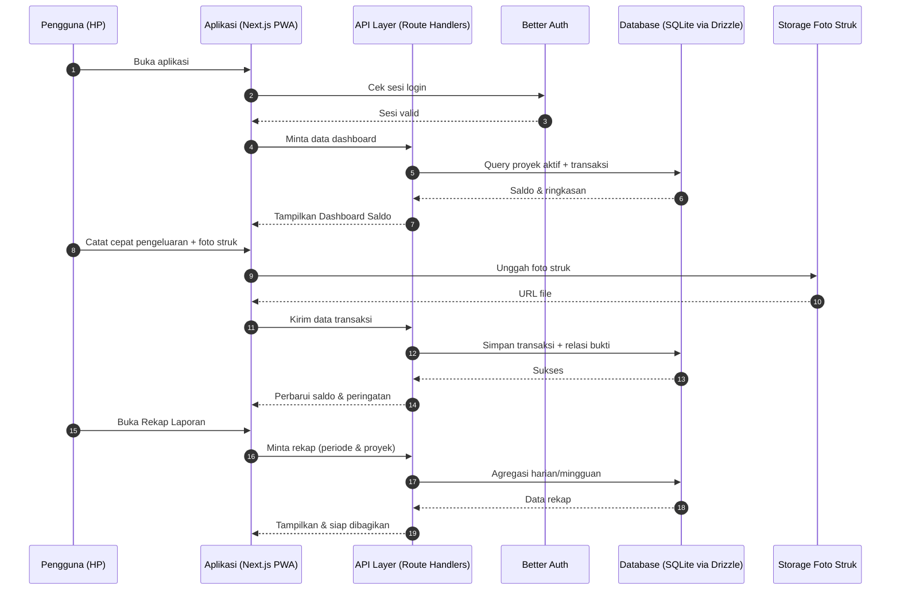
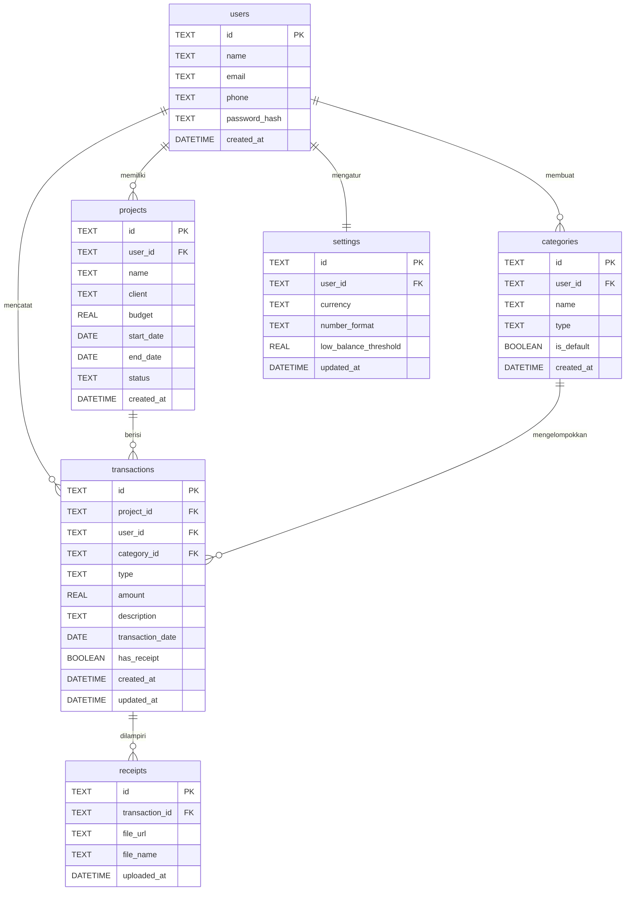

# PRD — Project Requirements Document

## 1. Overview

**Nama Aplikasi (usulan):** UangLapangan

**Latar Belakang Masalah**
Pemegang operasional lapangan (surveyor, tim pemetaan, atau petugas site visit) sering menerima uang muka (cash advance) dari kantor untuk membiayai kebutuhan proyek di lapangan — transport, penginapan, konsumsi, dan lain-lain. Selama ini pencatatannya masih dilakukan manual di buku, nota kertas, atau chat WhatsApp. Akibatnya:
- Catatan mudah hilang atau tercecer.
- Sulit tahu sisa uang di tengah proyek yang sedang berjalan.
- Dana antar proyek tercampur sehingga sulit dipisahkan.
- Bukti struk sering hilang sebelum rekap di kantor.
- Laporan akhir tidak rapi dan memakan waktu untuk disusun ulang.

**Tujuan Utama Aplikasi**
Membuat alat pencatatan keuangan lapangan yang **selalu ada di HP**, sehingga pemegang operasional dapat:
1. Melihat sisa uang tiap proyek secara langsung begitu membuka aplikasi.
2. Mencatat pengeluaran/pemasukan dalam hitungan detik, termasuk melampirkan foto struk.
3. Memisahkan pencatatan dana untuk setiap proyek (pemetaan atau site visit).
4. Menyusun rekap harian/mingguan yang rapi dan siap dibagikan ke atasan.

**Kemenangan Pertama (First Win)**
Halaman awal berupa **Dashboard Saldo** yang langsung menampilkan sisa uang proyek aktif beserta tombol cepat untuk mencatat pengeluaran baru.

---

## 2. Requirements

**Kebutuhan Fungsional**
- Pengguna dapat membuat, melihat, dan berpindah antar proyek.
- Pengguna dapat mencatat transaksi uang masuk dan uang keluar, lengkap dengan kategori dan tanggal.
- Setiap transaksi dapat dilampiri satu atau lebih foto bukti (struk/nota).
- Sistem otomatis menghitung sisa uang (saldo) per proyek dari dana awal ditambah pemasukan dikurangi pengeluaran.
- Sistem menampilkan peringatan ketika saldo proyek mendekati batas minimum.
- Pengguna dapat melihat rekap harian dan mingguan, serta memfilternya per proyek/periode.
- Pengguna dapat mengubah dan menghapus catatan transaksi yang salah.
- Pengguna memiliki akun pribadi untuk menjaga kerahasiaan data keuangan.

**Kebutuhan Non-Fungsional**
- **Mobile-first:** tampilan dan alur dioptimalkan untuk layar HP dan penggunaan satu tangan.
- **Cepat:** membuka aplikasi dan mencatat transaksi idealnya di bawah 10 detik.
- **Ramah offline di lapangan:** data yang sudah diisi tidak hilang saat sinyal lemah (minimal tersimpan lokal lalu disinkronkan saat kembali online).
- **Aman:** data hanya bisa diakses pemilik akun; foto struk disimpan privat.
- **Bahasa & format:** antarmuka Bahasa Indonesia, format mata uang Rupiah (dapat diubah di Pengaturan).
- **Sederhana:** minim istilah teknis, cocok untuk pengguna non-akuntan.

---

## 3. Core Features

Fitur berikut **selaras penuh dengan roadmap** dan disusun per fase.

### Fase 1 — Pencatatan Inti
- **Dashboard Saldo** *(prioritas: tinggi)*
  - Sisa Uang Proyek — menampilkan langsung sisa dana proyek yang sedang aktif.
  - Ringkasan Masuk & Keluar — total pemasukan dan pengeluaran dalam satu tampilan singkat.
  - Tombol Catat Cepat — tombol satu ketukan dari halaman utama untuk menambah pengeluaran.
  - Peringatan Saldo Menipis — tanda visual saat saldo mendekati ambang batas.
- **Catat Transaksi** *(prioritas: tinggi)*
  - Catat Pengeluaran — transport, penginapan, konsumsi, dan kebutuhan lapangan lain.
  - Catat Pemasukan — dana yang diterima untuk keperluan proyek.
  - Kategori & Tanggal — penandaan jenis dan tanggal transaksi agar mudah ditelusuri.
  - Ubah & Hapus Catatan — koreksi atau pembatalan catatan yang salah.

### Fase 2 — Bukti & Pemisahan Proyek
- **Bukti Struk** *(prioritas: tinggi)*
  - Foto Struk — mengambil foto langsung dari kamera HP saat transaksi terjadi.
  - Unggah dari Galeri — menambahkan bukti dari foto yang sudah tersimpan.
  - Lihat Lampiran — membuka kembali foto bukti dari daftar transaksi.
  - Tandai Tanpa Struk — memberi tanda pada transaksi yang buktinya belum lengkap.
- **Kelola Proyek** *(prioritas: tinggi)*
  - Daftar Proyek — melihat semua proyek yang pernah dan sedang dikerjakan.
  - Tambah Proyek — membuat proyek baru beserta dana yang disiapkan.
  - Pindah Proyek Aktif — mengganti proyek yang sedang dicatat tanpa keluar aplikasi.
  - Detail Proyek — rincian dana, transaksi, dan saldo satu proyek tertentu.

### Fase 3 — Rekap & Pelaporan
- **Rekap Laporan** *(prioritas: sedang)*
  - Rekap Harian — pemasukan & pengeluaran dalam satu hari kerja.
  - Rekap Mingguan — gambaran pemakaian dana selama satu minggu.
  - Filter Periode & Proyek — memilih rentang waktu dan proyek yang ingin dilihat.
  - Bagikan Rekap — mengirim atau mengekspor ringkasan ke atasan/tim.

### Fase 4 — Keamanan Akun
- **Masuk Akun** *(prioritas: sedang)*
  - Daftar Akun — membuat akun dengan email atau nomor HP.
  - Masuk & Keluar — akses dan keluar dengan aman dari perangkat.
  - Atur Ulang Sandi — memulihkan akses saat lupa kata sandi.

### Fase 5 — Penyesuaian
- **Pengaturan** *(prioritas: rendah)*
  - Atur Kategori — menyesuaikan jenis pengeluaran sesuai kebiasaan lapangan.
  - Format Uang — memilih mata uang dan cara penulisan angka.
  - Profil Pengguna — memperbarui nama dan informasi kontak.

---

## 4. User Flow

**A. Alur Utama Harian (Fase 1 & 2)**
1. Pengguna membuka aplikasi di HP.
2. Dashboard langsung tampil menampilkan **sisa uang proyek aktif** + ringkasan masuk/keluar.
3. Pengguna menekan **Tombol Catat Cepat**.
4. Pengguna mengisi jumlah, memilih kategori, dan tanggal (tanggal hari ini otomatis terisi).
5. Pengguna memfoto struk atau mengunggah dari galeri (opsional, dapat ditandai "tanpa struk").
6. Pengguna menyimpan; dashboard langsung memperbarui saldo.
7. Jika saldo menipis, muncul **peringatan saldo**.

**B. Alur Mengelola Proyek (Fase 2)**
1. Pengguna membuka **Daftar Proyek**.
2. Menambah proyek baru dengan nama, dana yang disiapkan, dan rentang tanggal.
3. Pengguna **berpindah proyek aktif** tanpa keluar dari aplikasi.
4. Setiap transaksi otomatis tercatat pada proyek yang sedang aktif.

**C. Alur Rekap & Berbagi (Fase 3)**
1. Pengguna membuka menu **Rekap Laporan**.
2. Memilih periode (harian/mingguan) dan proyek yang dituju.
3. Sistem menyusun ringkasan transaksi.
4. Pengguna membagikan atau mengekspor rekap ke atasan/tim.

**D. Alur Akun (Fase 4)**
1. Pengguna mendaftar dengan email/nomor HP.
2. Masuk ke aplikasi; data pribadi & keuangan terlindungi.
3. Jika lupa sandi, pengguna memakai fitur Atur Ulang Sandi.

**E. Alur Pengaturan (Fase 5)**
1. Pengguna membuka Pengaturan.
2. Menyesuaikan kategori, format uang, dan profil.

---

## 5. Architecture

Aplikasi dirancang **mobile-first** dengan pola satu aplikasi (Next.js sebagai PWA) yang melayani antarmuka dan API. Penyimpanan data transaksional menggunakan SQLite (mode lokal/server) melalui Drizzle ORM, dan identitas pengguna dikelola Better Auth. Foto struk disimpan di penyimpanan file, sedangkan metadata transaksi tersimpan di basis data.

**Alur Data Singkat**
- **Frontend:** Next.js (App Router) + Tailwind CSS + shadcn/ui, diakses sebagai PWA dari HP.
- **API Layer:** Route Handlers di dalam Next.js sebagai perantara antarmuka ke database.
- **Autentikasi:** Better Auth mengelola sesi, pendaftaran, dan reset sandi.
- **Data:** SQLite dengan Drizzle ORM (skema proyek, kategori, transaksi, bukti, pengaturan).
- **File:** Foto struk disimpan di object storage/penyimpanan file, database hanya menyimpan referensinya.
- **Penyajian:** Aplikasi di-deploy sebagai layanan web (mis. Vercel) dan dapat di-"install" ke layar utama HP.

---

## 6. Database Schema

Berikut tabel-tabel inti beserta kolom utamanya.

**users** — menyimpan data akun pengguna.
| Kolom | Tipe | Kegunaan |
|---|---|---|
| id | TEXT (PK) | Identitas unik pengguna |
| name | TEXT | Nama tampilan |
| email | TEXT (unik) | Surel untuk login |
| phone | TEXT | Nomor HP (alternatif login) |
| password_hash | TEXT | Sandi terenkripsi (Better Auth) |
| created_at | DATETIME | Waktu pendaftaran |

**projects** — menyimpan tiap proyek/kegiatan lapangan.
| Kolom | Tipe | Kegunaan |
|---|---|---|
| id | TEXT (PK) | Identitas proyek |
| user_id | TEXT (FK → users) | Pemilik proyek |
| name | TEXT | Nama proyek |
| client | TEXT | Klien/pemberi kerja (opsional) |
| budget | REAL | Dana awal yang disiapkan |
| start_date | DATE | Tanggal mulai |
| end_date | DATE | Tanggal selesai (opsional) |
| status | TEXT | aktif / selesai / arsip |
| created_at | DATETIME | Waktu dibuat |

**categories** — kategori pemasukan/pengeluaran.
| Kolom | Tipe | Kegunaan |
|---|---|---|
| id | TEXT (PK) | Identitas kategori |
| user_id | TEXT (FK → users) | Pemilik (untuk kategori kustom) |
| name | TEXT | Nama kategori (transport, konsumsi, dll) |
| type | TEXT | income / expense |
| is_default | BOOLEAN | Kategori bawaan sistem |
| created_at | DATETIME | Waktu dibuat |

**transactions** — catatan utama uang masuk & keluar.
| Kolom | Tipe | Kegunaan |
|---|---|---|
| id | TEXT (PK) | Identitas transaksi |
| project_id | TEXT (FK → projects) | Proyek terkait |
| user_id | TEXT (FK → users) | Pencatat |
| category_id | TEXT (FK → categories) | Kategori transaksi |
| type | TEXT | income / expense |
| amount | REAL | Nominal uang |
| description | TEXT | Keterangan singkat |
| transaction_date | DATE | Tanggal transaksi |
| has_receipt | BOOLEAN | Penanda bukti lengkap/tanpa struk |
| created_at | DATETIME | Waktu dibuat |
| updated_at | DATETIME | Waktu diubah terakhir |

**receipts** — lampiran foto bukti per transaksi.
| Kolom | Tipe | Kegunaan |
|---|---|---|
| id | TEXT (PK) | Identitas lampiran |
| transaction_id | TEXT (FK → transactions) | Transaksi terkait |
| file_url | TEXT | Lokasi file foto struk |
| file_name | TEXT | Nama file asli |
| uploaded_at | DATETIME | Waktu unggah |

**settings** — preferensi tampilan & peringatan.
| Kolom | Tipe | Kegunaan |
|---|---|---|
| id | TEXT (PK) | Identitas pengaturan |
| user_id | TEXT (FK → users) | Pemilik pengaturan (unik) |
| currency | TEXT | Mata uang (default IDR) |
| number_format | TEXT | Format penulisan angka |
| low_balance_threshold | REAL | Ambang peringatan saldo menipis |
| updated_at | DATETIME | Waktu perubahan |

---

## 7. Tech Stack

Semua pilihan di bawah ini adalah rekomendasi default yang paling sesuai untuk aplikasi mobile-first berukuran kecil–menengah, gratis atau berbiaya rendah, dan mudah dirawat.

**Frontend**
- **Next.js (App Router)** — kerangka utama; mendukung PWA sehingga aplikasi bisa dipasang di layar utama HP.
- **Tailwind CSS** — styling cepat dan responsif untuk layar HP.
- **shadcn/ui** — komponen antarmuka siap pakai (kartu saldo, tombol catat cepat, form, dialog).

**Backend**
- **Next.js Route Handlers (API Layer)** — melayani permintaan data dashboard, transaksi, rekap, dan unggah struk. Satu basis kode untuk frontend dan backend sehingga pengembangan lebih sederhana.

**Database**
- **SQLite** — basis data ringan, cepat, dan cocok untuk pencatatan transaksi perorangan.
- **Drizzle ORM** — pemetaan skema tabel dan query yang aman serta mudah dibaca.

**Autentikasi**
- **Better Auth** — mengelola pendaftaran akun, sesi login, keluar, dan atur ulang sandi (Fase 4).

**Penyimpanan File**
- Object storage untuk menyimpan foto struk; database hanya menyimpan tautan filenya.

**Deployment**
- **Vercel** — hosting Next.js dengan proses deploy otomatis dan gratis untuk skala awal. Bisa dipasang sebagai PWA di HP pengguna.

**Catatan Opsional**
- Jika kelak membutuhkan fitur kolaborasi tim, sinkronisasi multi-perangkat, atau notifikasi real-time, aplikasi dapat dimigrasikan ke basis data terkelola (mis. PostgreSQL) tanpa mengubah struktur data secara besar karena sudah menggunakan ORM.